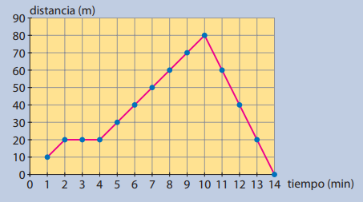
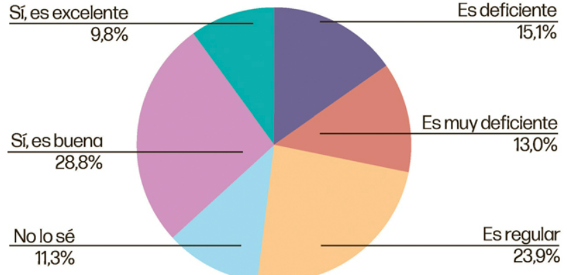

## Homework 

1. Relaciona cada situación con algún tipo de gráfico:
- a) Velocidad de frenado promedio de 5 modelos distintos de vehículos. 
Gráfico de columnas: 
Eje x = modelos de vehículos. 
Eje y = Velocidad promedio de frenado. 
- b) Costo de una llamada por segundos. 
Gráfico de líneas:
Eje x = Csoto de la llamada. 
Eje y = Segundos de duración. 
- c) El recorrido del equipo de ventas de una distribuidora con 4 paradas y las sumas vendidas en cada una. 
Mapa georeferenciado: 
Latiud y longitud de cada parada. 
Importe de ventas totales en cada punto. 
- d) Cantidad de edificios y casas que conforman un barrio.
Gráfico circular: 
Dos categorias. 
Cantidad total por categoría. 

2. El siguiente gráfico representa el movimiento vehículo desde un punto. Interprétala y responde a las siguientes preguntas:
- a) ¿Cuánto tiempo ha estado andando?. Estuvo andando durante 13 min.
- b) ¿Hasta que distancia máxima del recorrido pudo realizar? 80 m. 
- c) ¿Ha hecho alguna parada? Si duarante 2 min.
- d) ¿Que sucede luego del pico de mts recorrido? El vehículo comienza a regresar.
- e) ¿Cuantos metros recorrio en total? Recorrio 150 mts.

3. Se decide presentar el volumen de ventas de 5 productos correspondientes a una distribuidora de alimentos. Los productos van de A = 100 un., B = 95 un., C =90 un., D = 88 un., E = 105 un.
 - a) ¿Que gráfico utilizaría?. Sería conveniente utilizar un gráfico de barras.
 - b) ¿Sería correcto utilizar un gráfico de lineas? ¿Por qué?. Los gráficos de línea son recomanedables para representaciones evolutivas y series de tiempo.
 - c) ¿Sería correcto utilizar un gráfico circular? ¿Por qué?. Los gráficos circulares no son recomendables para más de 3 variables o cuando la diferencia en las magnitudes de cada categoria no es muy notoria. 
 
4. Se presenta el siguiente gráfico. 
 - a) ¿Es correcta su utilización? No es correcta la elección del gráfico, se dificulta el reconocimiento de patrones.
 - b) ¿Que inconveniente presenta a la hora de reconocer patrones? Se dificulta reconocer las magnitudes de las categorías a simple vista.
 - c) ¿Qué otros tipos de gráficos utilizaría? Se podría utilizar un gráfico de barras ordenado por calificación.
 - d) ¿Que tipo de tematicas estarían relacionadas a la variable presentada? Podría relacionarse la satisfacción del cliente en general.
 

5. Elaborar al menos 3 KPIs del negocio utilizando el modelo de datos trabajado la clase anterior. Tener en cuenta que deben ser métricas fácilmente graficables, por lo tanto debemos asegurarnos de contar con los datos necesarios.
Tener en cuenta que... 
* Uno de los intereses de la gerencia es mejorar la plataforma OnLine, por lo tanto, incrementar las ventas por ese canal.
* Se reciben algunos reclamos relacionados con los días de demora en las entregas de los prodcutos, la gerencia está interesada en mejorar en este aspecto.
* La gerencia tiene intención de tener más claro cuáles son los productos de mayor venta, pero también, de mayor rentabilidad. 
* La gerencia está interesada en fomentar el aumento de ventas por sucursales  
Para pensar: 
    1.¿Necesito tener el claro las métricas que voy a utilizar?  
    2.¿La métrica necesaria debe tener algún filtro en especial?  
    3.La Meta que se definió ¿se calcula con la misma métrica?  
Genenrar en SQL, las vistas necesarias para reflejar los KPIs propuestos.